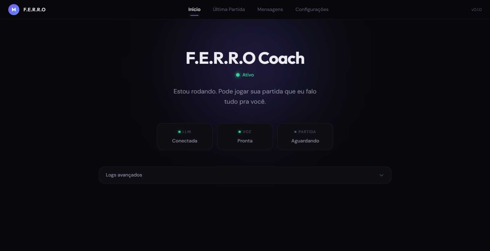
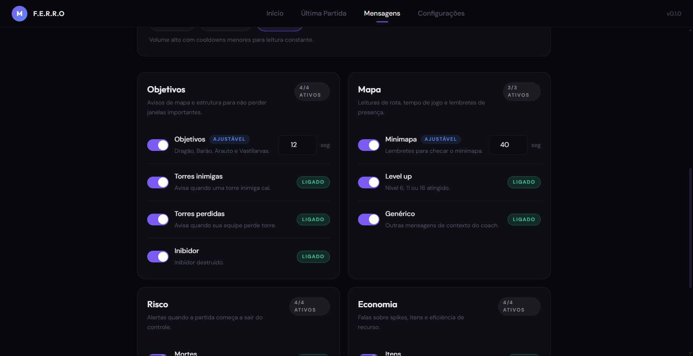
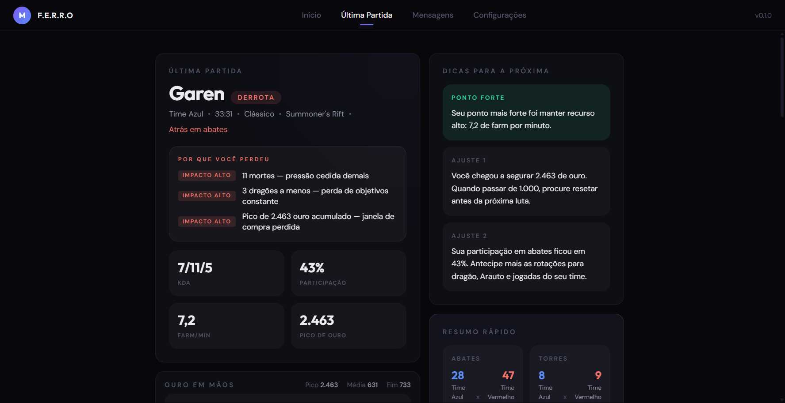
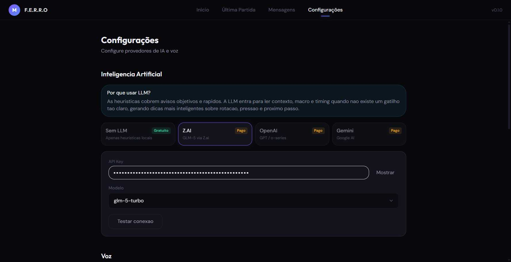

<p>
  
  <strong style="font-size: 1.5em;">F.E.R.R.O</strong><br>
  <em>Ferramenta Estratégica de Resposta em Rift Online</em><br><br>
  Coach por voz em tempo real para League of Legends. Analisa a partida, gera conselho tático (heurística ou LLM) e fala pra você — tudo em português.
</p>

<br clear="left"/>

<p>
  <a href="https://buymeacoffee.com/mickaelxd"></a>
  
  
  
</p>

---

## Como baixar

1. Clique no link abaixo para baixar o executável portátil (não precisa instalar):

   **[F.E.R.R.O v1.0.2 — Windows (.exe)](https://github.com/fortechdigital/F.E.R.R.O/releases/download/v1.0.2/F.E.R.R.O.1.0.2.exe)**

2. Execute o `.exe` e pronto — o app abre direto.

> Veja todas as versões na [página de releases](https://github.com/fortechdigital/F.E.R.R.O/releases).

---

## Como funciona

O F.E.R.R.O roda como app desktop (Electron) e se conecta à partida em andamento:

1. **Leitura** — polls a Live Client Data API do LoL em tempo real
2. **Análise** — detecta eventos, power spikes, objetivos, mortes e economia
3. **Decisão** — escolhe o que falar com base em cooldowns, prioridade e contexto
4. **Geração** — monta a frase via heurística ou LLM (OpenAI, Z.ai, Gemini)
5. **Voz** — fala com Piper (local), ElevenLabs (cloud) ou voz do sistema

## Galeria

<table>
  <tr>
    <td align="center"><b>Dashboard</b></td>
    <td align="center"><b>Mensagens do coach</b></td>
  </tr>
  <tr>
    <td></td>
    <td></td>
  </tr>
  <tr>
    <td align="center"><b>Análise da última partida</b></td>
    <td align="center"><b>Configurações</b></td>
  </tr>
  <tr>
    <td></td>
    <td></td>
  </tr>
</table>

## Funcionalidades

| Categoria | Detalhe |
|-----------|---------|
| Coaching em tempo real | Cooldown por categoria e grupo de eventos |
| Tom do coach | `serio`, `meme`, `puto` |
| Mensagens | Ajuste fino por categoria (objetivos, mapa, risco, economia...) + presets |
| Onboarding | Instalação automática do Piper no primeiro uso |
| TTS | Preview e teste direto na interface |
| LLM | Teste de conexão e exemplo de resposta no app |
| Pós-partida | Métricas, timeline e insights da última sessão |
| Debug | Logs de runtime, snapshots e payload de LLM (opcional) |

## Stack

| Camada | Tecnologia |
|--------|-----------|
| Desktop | Electron + electron-vite |
| UI | React 19 + TypeScript + Tailwind CSS 4 |
| Config | electron-store |
| LLM | OpenAI SDK (compatível com Z.ai, OpenAI e Gemini) |
| TTS | Piper (local), ElevenLabs (cloud), say (sistema) |

## Requisitos

- **Windows** (portable x64)
- **Node.js 20+** e npm
- **League of Legends** em execução para coaching ao vivo
- Internet para LLM remota e/ou ElevenLabs

## Início rápido

```bash
# dev
npm install
npm run dev

# build
npm run build:win    # gera portable em dist/
```

## Fluxo de uso

1. Abra o app
2. No primeiro uso, complete o onboarding do Piper
3. Em **Configurações**, escolha provider de LLM e voz
4. (Opcional) Em **Mensagens**, aplique um preset (`essencial`, `equilibrado`, `agressivo`)
5. Inicie uma partida no LoL — o engine detecta e começa a coachear automaticamente

## Estrutura do projeto

```text
src/
  core/        lógica de jogo, análise, decisão e voz
  main/        processo principal Electron, IPC e serviços
  renderer/    interface React (dashboard, análise, mensagens, settings)
  preload/     ponte segura entre renderer e main
  shared/      tipos e canais IPC compartilhados
resources/
  icon.*       ícones do app
  screens/     capturas usadas no README
```

## Dados locais

O app usa `~/.ferroconfig` para config, binários do Piper, modelos de voz e logs.

## Troubleshooting

| Problema | Solução |
|----------|---------|
| `waiting_for_game` para sempre | Confirme que está em partida (não apenas no client). Teste `https://127.0.0.1:2999/liveclientdata/allgamedata` no navegador |
| Piper sem voz | Valide paths em config ou rode onboarding novamente em Configurações > Voz |
| ElevenLabs mudo | Confira API key e `voiceId`. Use o botão de teste de voz |
| LLM sem resposta | Confira `endpoint`, `model` e API key. Use teste de LLM em Configurações |

## Scripts

| Comando | Descrição |
|---------|-----------|
| `npm run dev` | Desenvolvimento com hot-reload |
| `npm run build` | Build de produção |
| `npm run build:win` | Empacota portable Windows |
| `npm test` | Testes (Vitest) |
| `npm run typecheck` | Validação TypeScript |

## Créditos

Desenvolvido com apoio de [ForTech Digital](https://fortechdigital.com.br).

## Licença

MIT
